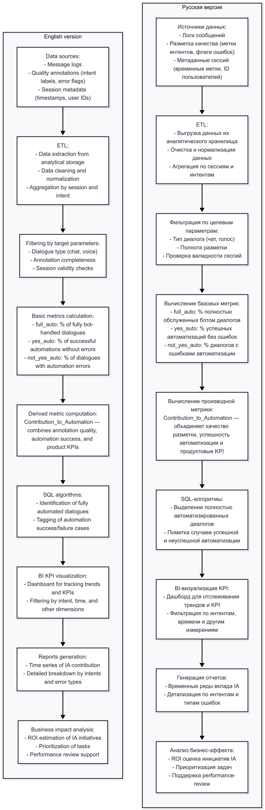

# Contribution-to-Automation Metric for Intent Analysts (IA)

---

## 🇬🇧 English version

**Timeline:** Q1 2024  
**Role:** ML/NLP Engineer  
**Tech stack:** Python • pandas • scikit-learn • SQL • ETL • BI tools  

### Context  
The chatbot product team lacked a way to quantitatively measure the contribution of the *Intent Analysts (IA)* team to the chatbot’s quality improvement. Overall performance metrics aggregated results from developers, ML engineers, and analysts, making it impossible to isolate IA’s impact and justify business initiatives.

### Goal  
Develop a metric and analytical tool to:  
- Measure the progress and contribution of the IA team in chatbot response automation.  
- Identify growth areas and prioritize tasks.  
- Create transparent reporting for performance reviews.

### Approach  

**Data Pipeline**  
- Extraction and aggregation of data from analytics storage: message logs, answer quality annotations, session metadata.  
- ETL process filtering by target parameters (dialogue type, annotation completeness, etc.).

**Metric Design**  
- Custom formula **Contribution_to_Automation** linking annotations, automation success, and product metrics.  
- Derived indicators:  
  - full_auto — % of dialogs fully handled by the bot.  
  - yes_auto — % of successful automations without errors.  
  - not_yes_auto — % of dialogs with errors.  
  - interpol_yes_threads_auto — interpolated automation success.

**Analytics & Visualization**  
- SQL algorithms to identify fully automated dialogs.  
- KPI visualization in BI platform.  
- Reports showing team contribution dynamics and intent change details.

### Results  
- First quantitative evaluation of IA team’s contribution to chatbot quality.  
- Used for ROI evaluation and prioritization of analytics initiatives.  
- Improved transparency of reporting at team and management levels.  
- Identified bottlenecks enabling targeted automation quality improvements.

### Business Impact  
- Increased accuracy of chatbot quality assessment at intent analytics level.  
- Reduced decision-making time on resource allocation.  
- Established foundation for regular team performance reviews.

### Key Skills Highlighted for ML/NLP Engineer  
- Building quality metrics for ML/NLP systems.  
- ETL pipelines for text data.  
- Analysis and aggregation of user dialogues.  
- Development of custom metrics for automation evaluation.

### Data Pipeline

---

## 🇷🇺 Русский вариант

**Timeline:** Q1 2024  
**Роль:** ML/NLP инженер  
**Технологии:** Python • pandas • scikit-learn • SQL • ETL • BI инструменты  

### Контекст  
В продуктовой команде чатбота отсутствовал способ количественно измерить вклад команды *Intent Analysts (IA)* в улучшение качества бота. Общие показатели эффективности учитывали совокупный результат работы разработчиков, ML-инженеров и аналитиков, что не позволяло выделить влияние интент-аналитики и аргументировать бизнес-инициативы.

### Цель  
Разработать метрику и аналитический инструмент, позволяющий:  
- Измерять прогресс и вклад команды IA в автоматизацию ответов чатбота.  
- Выявлять зоны роста и приоритизировать задачи.  
- Создавать прозрачную отчетность для performance-review.

### Подход  

**Data Pipeline**  
- Выгрузка и агрегация данных из аналитического хранилища: логи сообщений, разметка качества ответов, метаданные сессий.  
- ETL-процесс с фильтрацией по целевым параметрам (тип диалога, полнота разметки и др.).

**Метрика**  
- Авторская формула **Contribution_to_Automation** — связывает разметку, успешность автоматизации и продуктовые метрики.  
- Производные показатели:  
  - full_auto — % диалогов, полностью обслуженных ботом.  
  - yes_auto — % успешных автоматизаций без ошибок.  
  - not_yes_auto — % диалогов с ошибками.  
  - interpol_yes_threads_auto — интерполированная успешность автоматизации.

**Аналитика и визуализация**  
- SQL-алгоритмы для выделения полностью автоматизированных диалогов.  
- Визуализация KPI в BI-платформе.  
- Отчеты с динамикой вклада команды и детализацией по изменениям интентов.

### Результаты  
- Впервые получена количественная оценка вклада команды IA в качество чатбота.  
- Используется для ROI-оценки и приоритизации аналитических инициатив.  
- Улучшена прозрачность отчетности для команды и руководства.  
- Выявлены узкие места, что позволило повысить качество автоматизации.

### Бизнес-эффект  
- Повышена точность оценки качества чатбота на уровне интент-аналитики.  
- Сокращено время принятия решений о перераспределении ресурсов.  
- Создана база для регулярного performance-review команды.

### Ключевые навыки ML/NLP инженера  
- Построение метрик качества ML/NLP систем.  
- ETL-пайплайны для текстовых данных.  
- Анализ и агрегирование пользовательских диалогов.  
- Разработка кастомных метрик оценки автоматизации.

### Пайплайн

