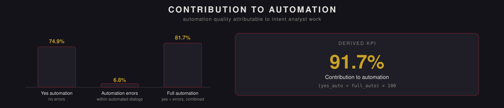

<p align="center">
  
</p>

<p align="right"><a href="README.md">English version →</a></p>

# Метрика вклада интент-аналитиков в автоматизацию


> **О коде.** Этот репозиторий описывает методологию, ключевые решения и результаты. Реализация является собственностью компании, в которой создавался проект, и не публикуется.

Авторская метрика, впервые позволившая выделить конкретный вклад команды Intent Analysts (IA) в качество автоматизации чат-бота — отделив «интент хорошо размечен» от «сама логика бота работает корректно» как две самостоятельные, независимо диагностируемые причины успеха или сбоя автоматизации.

## Проблема

Продуктовая команда могла измерить общую автоматизацию чат-бота, но не могла понять, **чья именно работа её двигает**. Совокупные показатели смешивали вклад разработчиков, ML-инженеров и интент-аналитиков, что делало невозможным обоснование IA-специфичных инициатив, кадровых решений или изменений процесса данными — решения аргументировались качественно, без цифры, на которую можно было бы опереться.

## Метрика

Каждый автоматизированный диалог попадает в одну из двух категорий: либо завершился без ошибок (`yes_auto`), либо был автоматизирован, но столкнулся с ошибкой по пути (`not_yes_auto`). Вместе они составляют всю автоматизацию (`full_auto = yes_auto + not_yes_auto`).

```
contribution_to_automation = (yes_auto ÷ full_auto) × 100
```

Это отделяет **качество** автоматизации от её **охвата**: диалог может быть автоматизирован (учтён в `full_auto`), но всё равно завершиться с ошибкой — и эта ошибка гораздо чаще связана с тем, как определён и размечен интент, чем с тем, пытался ли бот вообще его обработать. Отслеживание этого соотношения отдельно от общего показателя автоматизации — именно то, что позволило команде различать две принципиально разные проблемы, которые снаружи выглядели одинаково: *«интент плохо определён»* против *«с интентом всё в порядке, но сама процедура не справляется»*.

*Цифры выше — из реального рассчитанного примера (74.9% / 6.8% / 81.7% / 91.7%), показаны для иллюстрации поведения метрики, а не как непрерывно обновляемый продовый показатель.*

## Подход

- **Пайплайн данных** — выгрузка и агрегация из аналитического хранилища: логи сообщений, разметка качества ответов, метаданные сессий, отфильтрованные через ETL-шаг по типу диалога и полноте разметки.
- **Конструирование метрики** — разработаны `full_auto`, `yes_auto`, `not_yes_auto` и интерполированный вариант (`interpol_yes_threads_auto`) для корректной работы с частично размеченными периодами без их полного исключения из расчёта.
- **Аналитика и отчётность** — SQL-логика для выделения полностью автоматизированных диалогов на масштабе, визуализация KPI встроена в BI-платформу команды для постоянного использования.

## Масштаб

Рассчитывалась по всем каналам чат-бота и интентам, за которые отвечала команда, при этом сама команда IA насчитывала около 10 человек на канал (больше — на самом крупном канале). Спроектирована для расчёта раз в квартал, с возможностью вручную выгрузить тот же расчёт за любой произвольный период.

## Результаты

- Первая количественная оценка конкретного вклада IA в качество автоматизации чат-бота, отдельно от общего показателя автоматизации продукта.
- Появилась возможность диагностировать, **где именно** возникает проблема автоматизации: итоговый показатель мог выглядеть одинаково и при плохо определённом интенте, и при сломанной процедуре — именно эта метрика позволила различать эти два случая.
- Использована для построения первого обоснования вклада IA на данных — в ситуации, когда раньше этот вклад аргументировался только качественно.

## Влияние на бизнес

- Дала продуктовой команде обоснованную числовую базу для приоритизации: чинить со стороны IA или со стороны инженерии/процедур — вместо того чтобы предполагать, куда вкладываться.
- Заложена как переиспользуемая методология: метрика спроектирована для пересчёта по запросу для любого канала или периода, а не как разовый расчёт.

## Технологии

Python · pandas · SQL · ETL · BI-инструменты отчётности

---

<sub>Индивидуальный проект в рамках роли Data Analyst / Intent Analytics. Описан здесь в портфолио-целях; продовый код не публикуется.</sub>
